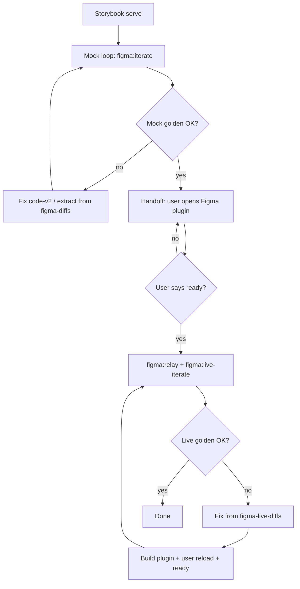

# Reference — figma-renderer-until-pass

## Three-test stack

```
test:pixel     Storybook → extract → HTML reconstructor → screenshot
               Schema lossless gate.

test:figma     Storybook → extract → code-v2 (mock) → scene-to-html → screenshot
               Fast renderer iteration (figma-diffs/).

test:figma:live  Storybook → extract → Figma Desktop plugin → exportAsync PNG
                 Real Figma engine (figma-live-diffs/).
```

Run `test:pixel` on a failing story when unsure if the bug is extraction vs rendering.

## Full agent flow (summary)



**Critical:** The agent must not run live tests until the user confirms the plugin bridge is connected.

## Mock pipeline

```
code-v2 → figma-mock → scene-to-html.ts → Chromium screenshot
```

Mock `createNodeFromSvg()` stores SVG; browser paints inline `<svg>`. Matches Chrome, not Figma’s SVG importer.

## Live pipeline

```
figma-live-test.ts
  → extract JSON
  → ws://localhost:3456 render-export
  → plugin UI → import-and-export-png → exportAsync PNG
  → pixelmatch vs Storybook
```

- No manual artifact import in Figma.
- Manifest `devAllowedDomains` must use **`localhost`** (not `127.0.0.1`).
- Plugin UI must show **Live test bridge: connected**.

## Tolerance semantics

| Status | Condition (default 0.1%) |
|--------|---------------------------|
| pass | diff ≤ 0.1% |
| warn | diff ≤ 0.4% |
| fail | diff > 0.4% |
| error | harness threw |

`--strict` on iterate scripts treats warn as failure.

## Mock vs live diagnosis

| Symptom | Likely cause |
|---------|----------------|
| Mock OK, live FAIL | Figma-specific: `createNodeFromSvg`, text metrics, fills, fonts |
| Both FAIL | `code-v2.ts` or extractor |
| Live OK, mock FAIL | `scene-to-html.ts` |
| Pixel FAIL | `extract.ts` / contract |

## Common renderer fixes (code-v2.ts)

| Hotspot pattern | Typical fix |
|-----------------|-------------|
| `$49` + `/month` overlap | Inline row → horizontal auto-layout, baseline |
| Button label off-center in live only | `textAlignHorizontal` + full inner width |
| Text clipped | `textAutoResize`, line-height cap |
| Donut / dashed circle wrong in live | Arc `<path>` instead of dashed `<circle>` |
| White blocks on frames | Clear default frame fills |
| Shadow spread crash | `clipsContent` + spread rules |

## report.json shape

Same structure under `figma-diffs/report.json` and `figma-live-diffs/report.json`.

Live per-story PNGs: `storybook.png`, `figma.png` (not `rendered.png`).

Folder names: `safeSegment(storyId)` — `lab-pricingpanel--pro` → `lab-pricingpanel-pro`.

## User phrases

| Phrase | Agent action |
|--------|----------------|
| **run until pass** | Mock loop → Figma handoff → live loop → done |
| **make fixes after live test** | **Live only:** read `figma-live-diffs` → fix → rebuild → ready → re-live |
| continue live / fix after live | Same as make fixes after live test |
| fix until pass / iterate until green | Same as run until pass |
| **ready** / go / plugin connected | Run or re-run live tests |

**ready** is required before the first live run in a session (if plugin not already connected) and after each plugin rebuild.
