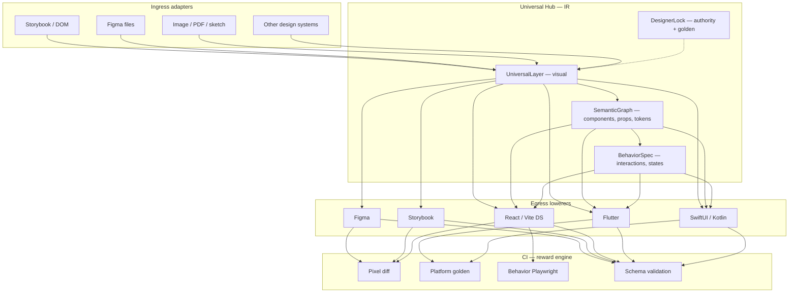
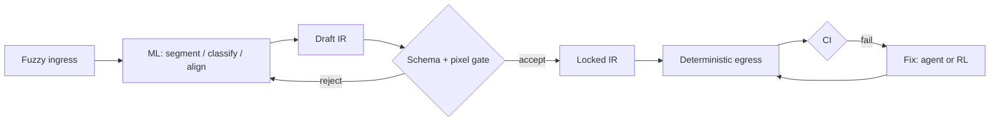
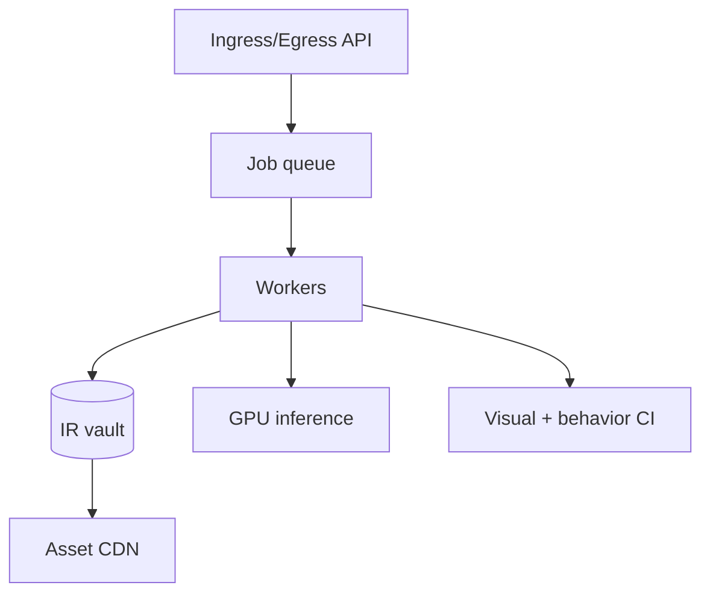

# Architecture

**Version:** 0.1.0 · 2026-05-22

---

## System overview



---

## Design principles

| Principle | Meaning |
| --- | --- |
| **Compiler, not chatbot** | Structured ingress → IR → lowering passes |
| **IR first** | All targets derive from the same hub |
| **ML proposes, CI disposes** | Models draft; gates accept or reject |
| **Deterministic where provable** | Exact geometry, colors, order — rules or verified emitters |
| **Designer lock** | Every screen knows its authority and golden reference |

---

## IR stack

### Layer 1 — UniversalLayer (visual)

Captures pixel-relevant surface state:

- Bounding boxes (post-transform, parent-local)
- Paint (fills, strokes, effects) — resolved colors, no CSS variables
- Typography — resolved faces, sizes, line metrics
- Layout hints — flex/grid metadata where needed for egress
- Children — pre-sorted by z-index and source order
- Embedded assets — self-contained (e.g. data URLs)

Conceptual shape:

```typescript
interface UniversalDocument {
  schemaVersion: string;
  meta: { extractedAt: string; viewport: { width: number; height: number } };
  root: UniversalLayer;
  designerLock?: DesignerLock;
}

interface UniversalLayer {
  id: string;
  name: string;
  box: { x: number; y: number; width: number; height: number };
  paint?: PaintSpec;
  layout?: LayoutSpec;
  transform?: TransformSpec;
  text?: TextSpec;
  image?: ImageSpec;
  children?: UniversalLayer[];
}
```

### Layer 2 — SemanticGraph

Maps visual layers to design-system meaning:

```typescript
interface SemanticGraph {
  components: Array<{
    layerId: string;
    type: string;           // e.g. "Button"
    variant?: string;       // e.g. "danger"
    props: Record<string, unknown>;
    slots?: Record<string, string[]>;
  }>;
  screens: Array<{
    id: string;
    route?: string;
    rootLayerId: string;
    variants: string[];     // loading, empty, error, filled
  }>;
  tokens: Record<string, string | number>;
}
```

### Layer 3 — BehaviorSpec

Developer-facing contract (no visual styling):

```typescript
interface BehaviorSpec {
  componentId: string;
  api: {
    dataProps: string[];
    stateFlags: string[];
    callbacks: Array<{ name: string; signature: string; when: string }>;
  };
  interactions: Array<{
    action: string;         // e.g. "click submit"
    expect: string;         // DOM or state change
    callback?: string;
  }>;
}
```

### DesignerLock

```typescript
interface DesignerLock {
  authority: "storybook" | "figma" | "image" | "manual";
  storyId?: string;
  figmaFileKey?: string;
  nodeId?: string;
  goldenPngSha256: string;
  toleranceProfile: "strict" | "live-raster" | "platform-native";
  lockedAt: string;
}
```

---

## Ingress strategies

| Source | Strategy | Phase |
| --- | --- | --- |
| DOM / Storybook | Deterministic extract (teacher) | P1 |
| Figma | Rules + ML alignment | P3 |
| Image | Vision model → draft IR → confirm | P4 |
| Other DS | Parse tokens/components → normalize | P3+ |

**Teacher principle:** When Storybook and another source exist for the same screen, Storybook extract (or the declared lock authority) wins for training labels.

---

## Egress strategies

| Target | Strategy | CI gate |
| --- | --- | --- |
| Figma | Plugin API ops / node DSL | Pixel vs lock |
| Storybook | Story files from IR + semantics | Pixel vs lock |
| React DS | AST emitter from SemanticGraph | Pixel + typecheck |
| Native | Per-platform emitter | Platform golden PNG |

Emitters produce **typed, compile-safe** output — LLM does not write arbitrary app code.

---

## ML placement



| Model role | When |
| --- | --- |
| Layout vision | Image → regions + draft layers |
| Component classifier | Layer subtree → DS type |
| Aligner | Figma node ↔ DOM subtree |
| Renderer specialist | JSON → Figma DSL (distillation) |
| Prop inferrer | Visual → semantic props |
| Fix agent | CI failure → patch proposal |

Detail: [`MODEL-STRATEGY.md`](./MODEL-STRATEGY.md).

---

## Hosted platform (P6)



Detail: [`INFRASTRUCTURE.md`](./INFRASTRUCTURE.md).

---

## See also

- [`PHASES.md`](./PHASES.md) — build order  
- [`GUIDELINES.md`](./GUIDELINES.md) — rules  
- [`APPENDIX-LAB-REFERENCE.md`](./APPENDIX-LAB-REFERENCE.md) — optional lab patterns  
