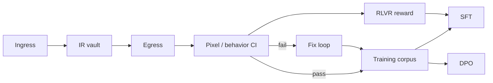

# Data pipeline

**Version:** 0.1.0 · 2026-05-22

---

## Purpose

Build training and evaluation corpora from platform CI — not from ad-hoc screenshots. The pixel harness is the **label generator**.

---

## What to log (start early — even in P1)

| Event | Fields |
| --- | --- |
| **Ingress success** | source type, input ref, IR path, duration, schema version |
| **Egress success** | target type, IR id, output tree/ref, render hash |
| **CI result** | suite, ir id, global%, region%, diff asset paths, pass/fail |
| **Fix attempt** | failure context, proposed patch, outcome, regression result |
| **DesignerLock** | authority, golden hash, tolerance profile, locked_at |
| **Human confirm** | image draft id, reviewer, accept/reject/edit |

### Storage

- Development: `training-corpus/` (gitignored) or local SQLite  
- Production: S3-compatible object store + metadata DB  
- Never commit raw customer designs without policy  

---

## Dataset targets

| Phase | Examples | Source |
| --- | --- | --- |
| P2 | 500+ labeled components | IR + semantic labels |
| P3 | 200+ Figma↔reference pairs | Paired goldens |
| P4 | 50K+ JSON→Figma traces | Egress execution logs |
| P4 | 10K+ fix triples | Fix loop history |
| P5 | 5K+ semantic→code pairs | Emitter output + BehaviorSpec |

---

## Record formats (conceptual)

### IR snapshot

```json
{
  "ir_id": "uuid",
  "schema_version": "1.0",
  "source": { "type": "dom", "ref": "..." },
  "document": { },
  "designer_lock": { }
}
```

### CI result

```json
{
  "ir_id": "uuid",
  "target": "figma",
  "global_diff_percent": 0.05,
  "worst_region_percent": 0.08,
  "passed": true,
  "profile": "strict"
}
```

### Fix triple

```json
{
  "ir_id": "uuid",
  "failure": { "diff_ref": "...", "regions": [] },
  "patch_ref": "git diff or file list",
  "passed_after": true,
  "regression_passed": true
}
```

---

## Synthetic augmentation

Increase diversity without manual design work:

| Technique | Produces |
| --- | --- |
| Token perturbation | New colors/spacing → re-extract IR |
| Variant flip | loading ↔ filled labels |
| Procedural layouts | Forms, lists, dashboards |
| Copy substitution | Text width stress tests |
| Font swap | Metric edge cases |

Always re-run CI on synthetics before adding to train set.

---

## Train / validation / test split

| Rule | Reason |
| --- | --- |
| Split by **component family** | Avoid leakage across variants |
| Hold out **entire screens** | Integration eval |
| Hold out **ingress source type** | Test generalization (e.g. no Figma in train) |
| **Tier regression** = generalization test | After every model deploy |

---

## Label quality

| Source | Trust level |
| --- | --- |
| CI pass at strict | High — auto-label |
| CI pass with raster profile | Medium — tag profile |
| Human confirmed image draft | High after confirm |
| Model draft without gate | **Do not train** |

---

## Privacy and consent

- Internal design system: default OK for logs with team policy  
- Customer uploads (P6): contract + retention limits  
- PII in screenshots: redact or exclude from train  
- Exportable delete: remove IR + logs by project id  

---

## Pipeline diagram



---

## See also

- [`MODEL-STRATEGY.md`](./MODEL-STRATEGY.md)  
- [`GUIDELINES.md`](./GUIDELINES.md) §10  
- [`PHASES.md`](./PHASES.md) — P4  
