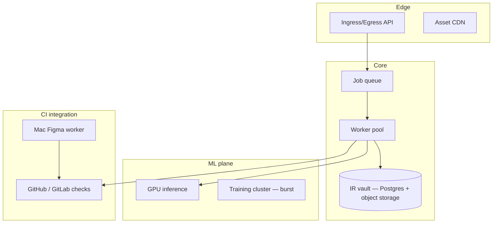

# Infrastructure

**Version:** 0.1.0 · 2026-05-22

---

## Environments

| Environment | Purpose |
| --- | --- |
| **Local dev** | Schema work, small adapters, unit tests |
| **CI (PR)** | Schema validate, pixel mock, typecheck |
| **CI (nightly)** | Full golden set, regression |
| **GPU dev** | SFT experiments, batch inference |
| **Staging** | Hosted platform preview (P6) |
| **Production** | IR vault, ingress queue, egress workers (P6) |

---

## Dev machine specs

| Spec | Minimum | Recommended |
| --- | --- | --- |
| CPU | 8 cores | Apple M2 Pro / Ryzen 7 |
| RAM | 16 GB | 32 GB |
| Disk | 50 GB free | 512 GB NVMe |
| GPU | Not required P0–P2 | 24 GB VRAM P4+ |
| OS | macOS or Linux | macOS if Figma Desktop egress |

---

## CI layout

| Tier | Runs | Runner |
| --- | --- | --- |
| PR | Schema validate, unit tests, mock pixel | GitHub Actions 4 vCPU |
| Nightly | Full golden pixel suite | 8 vCPU |
| Live Figma | Real Desktop export diff | **Mac worker** (self-hosted) |
| Behavior | Playwright matrix | Actions + artifacts |
| Native golden | Flutter/Swift screenshot diff | Mac or device farm P5 |

**Note:** Figma Desktop live export cannot run headless on Linux — dedicate a Mac mini or manual gate for live Figma CI.

---

## ML training infrastructure (P4+)

| Tier | Purpose | Spec | Cloud example |
| --- | --- | --- | --- |
| Dev train | SFT 1–7B | 1× RTX 4090 24GB | Lambda 1× A10 |
| Prod train | RLVR, 32B | 4–8× A100 80GB | AWS p4d, Coreweave |
| Inference | Batch ingress | 2× L4 or 1× A10 | Modal, Baseten |
| Agent API | Fix/orchestration | Anthropic/OpenAI | — |

### Rough cost (monthly)

| Stage | Estimate |
| --- | --- |
| P0–P2 (API agents only) | $200–800 |
| P4 SFT experiments | $2–5K one-time |
| P4+ sustained training | $5–15K at scale |

---

## Hosted platform architecture (P6)

| Component | Suggested host |
| --- | --- |
| API + IR vault | Fly.io, AWS ECS, or Railway + RDS + S3 |
| Pixel CI | GitHub Actions |
| Live Figma worker | Self-hosted Mac (Buildkite or custom) |
| GPU inference | Modal, Baseten, K8s GPU pool |
| Training | Burst Coreweave; datasets in object storage |

---

## Security and compliance

- IR contains embedded images — **design IP**; encrypt at rest  
- RBAC on IR vault per team/project  
- On-prem inference option (Llama + local GPU) for regulated clients  
- Audit log for ingress, regen, and lock changes  
- No customer data in public fine-tunes without contract  

---

## Observability

| Signal | Tooling |
| --- | --- |
| Ingress job latency | Queue metrics |
| CI pass rate | Dashboard per golden set |
| Model confidence | Logged on image ingress |
| Cost | GPU hours + API spend |

---

## Repository strategy

| Option | When |
| --- | --- |
| `docs/LLM-platform-plan/` in lab repo | Planning only (current) |
| New `llm-platform` monorepo | P1 implementation starts |
| Split IR schema package | P0 complete — publish `@platform/ir` |

This plan folder can live in the lab repo until the side project gets its own repository.

---

## See also

- [`MODEL-STRATEGY.md`](./MODEL-STRATEGY.md)  
- [`DATA-PIPELINE.md`](./DATA-PIPELINE.md)  
- [`RISKS-AND-GATES.md`](./RISKS-AND-GATES.md)  
